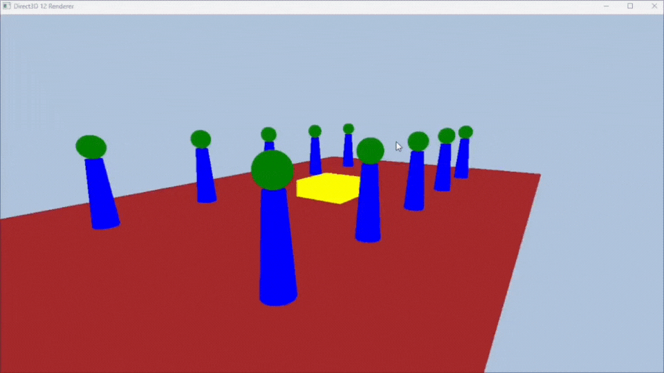

# 光照衰减（Light Attenuation）
当一个物体远离光源时，其受到的光照应该逐渐变弱，这个过程就称为**光照衰减（Attenuation）**。
在实时渲染中，我们常用一个线性函数来模拟这个过程，根据物体与光源的距离 `d`，以及设定的起止衰减距离，来计算一个 `0~1` 的衰减因子。

```c
float CalcAttenuation(float d, float falloffEnd, float falloffStart)
{
    // d 是顶点与光源的距离
    // falloffStart 是开始衰减的距离
    // falloffEnd 是完全衰减为 0 的距离
    float att = saturate((falloffEnd - d) / (falloffEnd - falloffStart));
    return att;
}
```


# 菲涅尔反射（Fresnel Reflectance）
当光线从一种介质进入另一种介质（如空气进入水或玻璃）时，会发生部分反射和折射。反射比例由菲涅尔方程决定，但真实的菲涅尔方程**计算量较大**。 为此，在图形渲染中我们常用**Schlick提出的近似公式**，可大幅减少运算量，并在视觉上效果仍然良好。

---
## 近似方程公式

```c
// Schlick gives an approximation to Fresnel reflectance (see pg. 233 "Real-Time Rendering 3rd Ed.").
// R0 = ((n - 1) / (n + 1))^2, where n is the index of refraction.
float3 SchlickFresnel(float3 R0, float3 normal, float3 lightVec)
{
    float cosIncidentAngle = saturate(dot(normal, lightVec));
    float f0 = 1.0f - cosIncidentAngle;
    float3 reflectPercent = R0 + (1.0f - R0) * (f0 * f0 * f0 * f0 * f0);
    return reflectPercent;
}
```

## 参数解释

| 参数 / Param        | 含义 / Description                                  |
|---------------------|----------------------------------------------------|
| `R0`                | 垂直入射时的反射率（通常由材质折射率决定）          |
| `normal`            | 表面的法线向量                                      |
| `lightVec`          | 指向光源方向的向量                                  |
| `cosIncidentAngle`  | 入射角的余弦值，计算方式为 `dot(normal, lightVec)` |
| `reflectPercent`    | 当前入射角对应的反射率                              |

---

## R₀的计算

垂直入射时的反射率 `R0` 由材质的折射率 `n` 计算得出，公式如下：

```c
R0 = ((n - 1) / (n + 1))^2
```

# 平行光源的光照计算 (Directional Light Illumination)
计算光强，并代入BlinnPhong函数，最终计算出不同材质的光反射量。
- **光强不随距离衰减**，因为平行光的光线方向固定且平行。
- 光照强度只与**入射角度**有关。
- 光照的基础是**兰伯特余弦定律**，即入射光与表面法线的夹角。

---

## 兰伯特光照模型

兰伯特光照的计算公式：

$I = L_d \cdot \max(\mathbf{n} \cdot \mathbf{L}, 0)$

- $I$：点上的漫反射光强  
- $L_d$：入射光的总辐照度（光强）  
- $\mathbf{n}$：顶点法线单位向量  
- $\mathbf{L}$：光线方向单位向量（指向光源）  

这里的 $\mathbf{n} \cdot \mathbf{L}$ 是点积，代表入射光与法线的夹角余弦。

---

## 代码示例（平行光强计算）

```c
float3 ComputerDirectionalLight(Light light, Material mat, float3 normal, float3 toEye)
{
    float3 lightVec = -light.direction; //光向量和光源指向顶点的向量相反
    float3 lightStrength = max(dot(normal, lightVec), 0.0f) * light.strength; //方向光单位面积上的辐照度
    
    //平行光的漫反射+高光反射
    return BlinnPhong(mat, normal, toEye, lightVec, lightStrength);
}
```

# 点光源的光照计算 (Point Light Illumination)

点光源的光强不仅受入射角度影响，还会受到**距离衰减**的影响，这与平行光最大的不同点。

- 光线从光源向四周发散，强度随距离递减。
- 需计算**顶点到光源的距离**来应用衰减。
- 光强同时受入射角和距离衰减影响。

---

## 代码示例

```c
float3 ComputePointLight(Light light, Material mat, float3 pos, float3 normal, float3 toEye)
{   
    // 计算顶点指向点光源的向量
    float3 lightVec = light.position - pos; 
    
    // 计算顶点到光源的距离
    float distance = length(lightVec);
    
    // 如果距离大于衰减最大范围，直接返回0，提高效率
    if(distance > light.falloffEnd)
        return 0;
    
    // 单位化光向量
    lightVec /= distance;
    
    // 计算法线与光向量的点积，代表光线入射角影响，点积不小于0
    float nDotl = max(dot(lightVec, normal), 0);
    
    // 计算未衰减的光强（单位面积上的辐照度）
    float3 lightStrength = nDotl * light.strength;
    
    // 调用之前定义的距离衰减函数计算衰减值
    float att = CalcAttenuation(distance, light.falloffEnd, light.falloffStart);
    
    // 应用衰减到光强
    lightStrength *= att;
    
    // 使用Blinn-Phong函数计算漫反射和镜面高光反射
    return BlinnPhong(mat, normal, toEye, lightVec, lightStrength);
}
```

#  聚光灯光照计算 (Spotlight Illumination)

聚光灯光强不仅受入射角度和距离衰减影响，还受**聚光灯的半顶角和光束衰减因子**控制，使光照集中且方向性强。

- 结合点光源的距离衰减和角度衰减。
- 光照强度会根据光线与聚光灯方向的夹角做衰减。
- 聚光灯因子通过半顶角权重控制光线集中范围。

---

##  聚光灯因子计算回顾

$spotFactor = \bigl(\max(-\vec{L} \cdot \vec{D}, 0)\bigr)^{spotPower}$

- $\mathbf{L}$：从顶点指向光源的单位光线向量  
- $\mathbf{D}$：聚光灯光束的方向单位向量  
- $\text{spotPower}$：控制聚光灯光束聚焦度的指数（越大光束越集中）  

---

## 代码示例

```c
float3 ComputeSpotLight(Light light, Material mat, float3 pos, float3 normal, float3 toEye)
{
    // 计算顶点到聚光灯光源的向量
    float3 lightVec = light.position - pos; 
    
    // 计算距离
    float distance = length(lightVec);
    
    // 超出最大衰减范围，直接返回0
    if (distance > light.falloffEnd)
        return 0;
    
    // 单位化光向量
    lightVec /= distance;
    
    // 计算法线与光向量点积（兰伯特项）
    float nDotl = max(dot(lightVec, normal), 0);
    
    // 未衰减的光强
    float3 lightStrength = nDotl * light.strength;
    
    // 距离衰减
    float att = CalcAttenuation(distance, light.falloffEnd, light.falloffStart);
    lightStrength *= att;
    
    // 计算聚光灯衰减因子（spotFactor）
    float spotFactor = pow(max(dot(-lightVec, light.direction), 0), light.spotPower);
    lightStrength *= spotFactor;
    
    // 计算最终光照（漫反射 + 镜面高光）
    return BlinnPhong(mat, normal, toEye, lightVec, lightStrength);
}
```

### RESULT

## Result for motipul object


## Result for adding FrameResource & RenderItems


## Result for D3D_PRIMITIVE_TOPOLOGY_TRIANGLELIST
